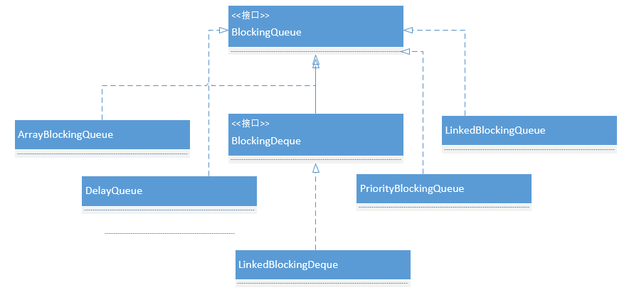

# BlockingQueue 队列之 ArrayBlockingQueue

一个线程持续生产对象插入到队列中，直到队列满，时发生阻塞等待，直到消费的线程从队列中拿走一个对象。消费的线程持续从该阻塞队列中拿出对象。如果队列空，将会处于阻塞等待，直到生产线程把一个对象插入队列。  
BlockingQueue 常用方法：

1. 阻塞方法： put(Object o),take()
2. 非阻塞方法： offer(Object o)，poll(Object o)，peek(Object o)
   立即返回一个特定的值 true / false。
3. 超时方法： offer(Object o, timeout, timeunit)，poll(timeout, timeunit)
   该方法调用将会在指定超时内发生阻塞，直到能够执行，返回 true / false。

BlockingQueue 阻塞队列是个接口，实现类如图：  
